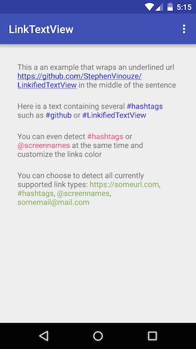
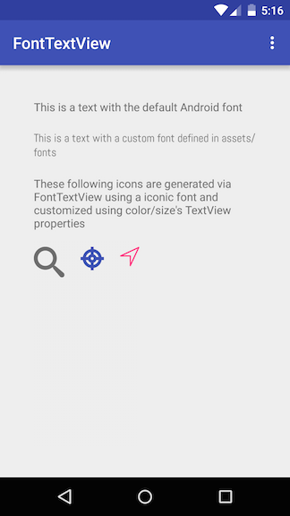

[](https://jitpack.io/#StephenVinouze/LinkifiedTextView)
[](https://android-arsenal.com/api?level=14)
[](https://github.com/StephenVinouze/LinkifiedTextView/blob/master/LICENSE)

# LinkifiedTextView
This library intends to leverage what [Linkify](http://developer.android.com/reference/android/text/util/Linkify.html) does but directly embedded inside a TextView with some preconfigured detectable link types.

Moreover, `Linkify` has a most often unwanted behavior that intercept touches inside the whole `TextView` instead of only the links that matches the activated link types. Hence, using `Linkify` results in a nearly non-clickable view. This is particularly annoying while working with a list of items that contains a big `TextView` inside.

It also comes with an utility [TextView](http://developer.android.com/reference/android/widget/TextView.html) class that lets you easily define your custom fonts. This comes very handy while using iconic fonts!




# Download

Under the *dependencies* block in Gradle, add the following line :

```
compile 'com.github.stephenvinouze:linkifiedtextview:{latest_version}'
```

# Usage

## TextView that detects links
Detecting links inside your TextView can be achieved by using the `LinkTextView` class

```
<com.stephenvinouze.linkifiedtextview.LinkTextView
            android:id="@+id/web_link"
            android:layout_width="wrap_content"
            android:layout_height="wrap_content"
            app:tvLinkText="<your_link_text>" // Mandatory : If you want the links to be detected you must use this property
            app:tvLinkTextColor="<your_link_color>" // Optional : default is Color.BLUE
            app:tvLinkType="<your_link_type>"/> // Optional : default is none, can be a combination of web|hashtag|screenname|email or all
```
You can listen to link click events using the `OnLinkClickListener` interface

```
LinkTextView webLink = (LinkTextView)findViewById(R.id.web_link);
webLink.setOnLinkClickListener(new OnLinkClickListener() {
    @Override
    public void onLinkClick(View textView, String link, int type) {
        // Do whatever you need here using the link content and its type
    }
});
```

## TextView with custom fonts
If you need to use a custom font that you previously added in your assets folder, use the `FontTextView` class

```
<com.stephenvinouze.linkifiedtextview.FontTextView
            android:id="@+id/custom_font_text"
            android:layout_width="wrap_content"
            android:layout_height="wrap_content"
            android:text="<your_text>"
            app:tvFontName="<your_font_name>.<font_name_extension>"/>
```

Works also for `EditText` :

```
<com.stephenvinouze.linkifiedtextview.FontTEditText
            android:id="@+id/custom_font_text"
            android:layout_width="wrap_content"
            android:layout_height="wrap_content"
            android:text="<your_text>"
            app:tvFontName="<your_font_name>.<font_name_extension>"/>
```

## Note
`LinkTextView` inherits from **FontTextView** so you can easily customize your font as well as detecting link using `LinkTextView`.

# License

```
Copyright 2015 Stephen Vinouze.

Licensed under the Apache License, Version 2.0 (the "License");
you may not use this file except in compliance with the License.
You may obtain a copy of the License at

   http://www.apache.org/licenses/LICENSE-2.0

Unless required by applicable law or agreed to in writing, software
distributed under the License is distributed on an "AS IS" BASIS,
WITHOUT WARRANTIES OR CONDITIONS OF ANY KIND, either express or implied.
See the License for the specific language governing permissions and
limitations under the License.
```
